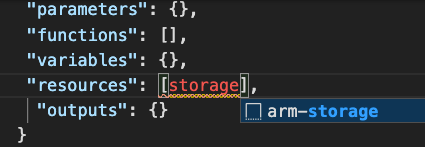

# [Deploy Azure infrastructure by using JSON ARM templates](https://docs.microsoft.com/en-us/learn/modules/create-azure-resource-manager-template-vs-code/)

## Learning objectives

* Implement a JSON ARM template by using Visual Studio Code (see [this useful extension](https://marketplace.visualstudio.com/items?itemName=msazurermtools.azurerm-vscode-tools))
* Declare resources and add flexibility to your template by adding resources, parameters, and outputs.

## ARM template structure

|Element| Description|
|-|-|
schema|A required section that defines the location of the JSON schema file that describes the structure of JSON data. The version number you use depends on the scope of the deployment and your JSON editor.
contentVersion|A required section that defines the version of **your** template (such as 1.0.0.0). Fill it as you like.
apiProfile|An optional section that defines a collection of API versions for resource types. You can use this value to avoid having to specify API versions for each resource in the template.
parameters|An optional section where you define values that are provided during deployment. These values can be provided by a parameter file, by command-line parameters, or in the Azure portal.
variables|An optional section where you define values that are used to simplify template language expressions.
functions|An optional section where you can define user-defined functions that are available within the template. User-defined functions can simplify your template when complicated expressions are used repeatedly in your template.
resources|A required section that defines the actual items you want to deploy or update in a resource group or a subscription.
output|An optional section where you specify the values that will be returned at the end of the deployment.

[Parameter example](#example-parameters-section-in-an-arm-template) | [Output example](#example-outputs-section-in-an-arm-template)

### Sample JSON ARM template

```JSON
{
  "$schema": "https://schema.management.azure.com/schemas/2019-04-01/deploymentTemplate.json#",
  "contentVersion": "1.0.0.0",
  "parameters": {
    "storageName": {
      "type": "string",
      "minLength": 3,
      "maxLength": 24,
      "metadata": {
        "description": "The name of the Azure storage resource"
      }
    },
    "storageSKU": {
      "type": "string",
      "defaultValue": "Standard_LRS",
      "allowedValues": [
        "Standard_LRS",
        "Standard_GRS",
        "Standard_RAGRS",
        "Standard_ZRS",
        "Premium_LRS",
        "Premium_ZRS",
        "Standard_GZRS",
        "Standard_RAGZRS"
      ]
    }
  },
  "functions": [],
  "variables": {},
  "resources": [
    {
      "name": "[parameters('storageName')]",
      "type": "Microsoft.Storage/storageAccounts",
      "apiVersion": "2019-06-01",
      "tags": {
        "displayName": "[parameters('storageName')]"
      },
      "location": "[resourceGroup().location]",
      "kind": "StorageV2",
      "sku": {
        "name": "[parameters('storageSKU')]",
        "tier": "Standard"
      }
    }
  ],
  "outputs": {}
}
```

## VSCode ARM extension usage

1. Create a new file ```template.json```
1. At the top of the file, start writing ```arm``` to view options
1. Use the pop-up shortcut ```arm!``` to create a blank ARM template:
    * 
1. In the resources section, start typing storage to view another shortcut:
    * 
1. Edit then the SKU, and see the IntelliSense options available:
    * 

Giving you a file like this:

```JSON
{
  "$schema": "https://schema.management.azure.com/schemas/2019-04-01/deploymentTemplate.json#",
  "contentVersion": "1.0.0.0",
  "parameters": {},
  "functions": [],
  "variables": {},
  "resources": [],
  "outputs": {}
}
```

## Example: Deploy ARM template to Azure using Powershell

```PowerShell
# get subscription ID for later
> Get-AzSubscription

# set subscription context
> $context = Get-AzSubscription -SubscriptionId {Your subscription ID}
> Set-AzContext $context

# deploy template
$templateFile="template.json"
$today=Get-Date -Format "MM-dd-yyyy"
$deploymentName="blanktemplate-"+"$today"
New-AzResourceGroupDeployment `
  -Name $deploymentName `
  -TemplateFile $templateFile
```

## Example: Parameters section in an ARM template

```JSON
...
"parameters": {
  "storageAccountType": {
    "type": "string",
    "defaultValue": "Standard_LRS",
    "allowedValues": [
      "Standard_LRS",
      "Standard_GRS",
      "Standard_ZRS",
      "Premium_LRS"
    ],
    "metadata": {
      "description": "Storage Account type"
    }
  }
}
...
```

## Example: Outputs section in an ARM template

```JSON
...
"outputs": {
  "storageEndpoint": {
    "type": "object",
    "value": "[reference('learntemplatestorage123').primaryEndpoints]"
  }
}
...
```
