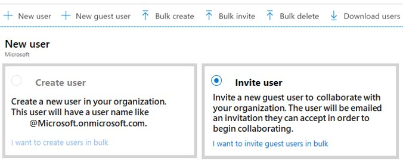
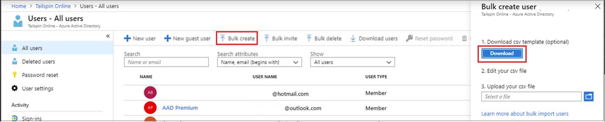

# [Configure user and group accounts](https://docs.microsoft.com/en-us/learn/modules/configure-user-group-accounts/)

## Learning objectives

* Configure users accounts and user account properties.
* Create new user accounts.
* Import bulk user accounts with a template.
* Configure group accounts and assignment types.

## User account types supported by Azure AD

|User account type|Description|
|--|--|
Cloud identity| User created and defined only in Azure AD. For example, administrator accounts and managed users. Can also be linked to a user account in an external AAD instance. If the account is removed from the primary directory, the account is deleted.
Directory-synchronized identity|User defined in on-prem AD and synced to AAD. The golden source is the Windows Server-based on-prem AD.
Guest user|Golden source is defined outside Azure. For example user accounts from other cloud providers, or any other company. These users can be invited to your AAD (and become guests), but they are defined elsewhere.

Most organizations end up supporting at least two types (cloud identities and guest users). If they also have an on-prem AD, they may need to support directory-sync identities as well.



### More on cloud identity accounts

* MUST have a display name (e.g. Barack Obama)
* MUST have a user account name, probably an email (e.g. barack.obama@hotmail.com)
* CAN have additional info like job title, other contact details, etc.
* Users with AD Role ```Global administrator``` or ```User administrator``` can preset profile data in user accounts, e.g. company address or main phone number
* Regular users can change their own profile information, but cannot change display name or user account name
* Restore options for deleted accounts can also be enabled, allowing up to 30 days retention of deleted accounts
* Sign-in and audit log info is available

## Creating user accounts in bulk

**Required role**: ```Global administrator``` or ```User administrator```

In Azure Portal > AAD > Users > All Users, download the template, fill it, and upload back to bulk create users. Any errors can be downloaded as a consolidated report from the **Bulk operation results** page



## Groups

* **Security groups**: Used to manage member or resource access to a shared resource
* **Microsoft 365 groups**: Group to create and manage collaboration features like a shared mailbox, calendar, files, SharePoint site etc.

Use groups to set permissions to all group members at the same time. There are three different ways to add members to a group:

1. **Assigned**: Manually add a user to a group. Each user can have unique permissions.
1. **Dynamic**: Apply rules to add users to a group automatically. Automatically maintained.
1. **Dynamic device**: (Only for security groups) Apply rules to automatically add/remove devices to security groups. Automatically maintained.

## Azure AD Administrative units

**Required role to configure**: ```Global administrator``` or ```Role administrator```

Acts as a container for users, groups and/or devices. Can't be nested.


