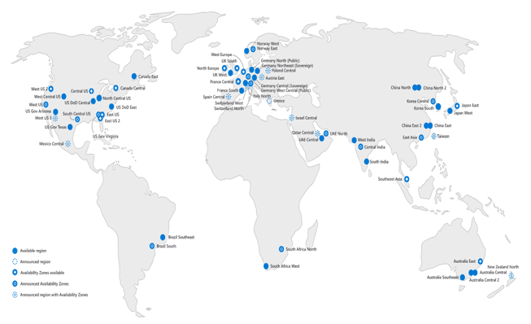

# [Configure subscriptions](https://docs.microsoft.com/en-us/learn/modules/configure-subscriptions/)

## Learning objectives

* Determine the correct region to locate Azure services.
* Identify features and usage cases for Azure subscriptions.
* Identify how to obtain an Azure subscription.
* Understand billing and features for different Azure subscriptions.
* Use the Cost Management product for cost analysis.
* Determine when to use resource tagging.
* Identify ways to reduce costs.

## Azure Regions

* Azure has more global regions than anyone else. For the latest info, see [here](https://azure.microsoft.com/en-gb/global-infrastructure/geographies/#geographies)
* Most Azure services require a region to be specified. Some global services don't - examples include Azure AD, MS Azure Traffic Manager, and Azure DNS
* To certain extent, resource types/SKUs may be limited to a particular region as they are developed
* Every region is paired with another region in the same geography (except Brazil which is paired to a region outside its own geography)

## Azure Regional Pairs

* 'Fail-over' for entire regions. If both go down, one is always prioritized/focused to bring services back up ASAP.
* Updates to Azure are done one region pair member at a time in a rolling fashion to minimize downtime
* Separated by >= 300 miles wherever possible
* Data generally resides in the same region (exceptions: Brazil, Singapore)

## Azure Subscription

**Management groups** (nestable), **Subscriptions** and **Resource groups** (in this order) provide levels of hierarchy to help organize resources. Subscriptions correspond to a 'contract' with Microsoft to use and pay for Azure services.

## Different ways to get Azure subscriptions

|Method|Description|
|--|--|
**Enterprise agreements**|Azure can be added to an existing Microsoft agreement by making an upfront payment to Azure. Enterprise agreements have 99.95% monthly SLA.
**Reseller**|Cloud services can also be bought via Microsoft resellers.
**Partners**|Microsoft Partners can design and build solutions for you on Azure, and you can pay for Azure services this way.
**Personal free account**|Anyone can sign up for a free trial of Azure.

### Subscription types

|Subscription Type|Description|
|--|--|
**Pay-as-you-go**|Monthly billing based on actual usage and/or reserved usage
**Enterprise agreement**|Customized for enterprise and large-scale clients
**Azure for Students**|Monetary credit for use within the first 12 months, no credit card required but must use a student organization email to verify student status.

## Cost Management features

|Feature|Description|
|--|--|
**Cost analysis**|Explore and analyze where the costs are coming from. See accumulated/estimated over time across custom periods. This data can also be exported. Default filters by resource types and specific resources. **Tags** (key-value pairs; max 50 per resource; not inherited from RG to resources in it) are considered best practice here, and allows for more fine-grained analysis.
**Budgets**|Can be defined as limits to help control costs.
**Recommendations**|Automated recommendations to optimize costs. They help identify un- and under-used resources.

## Cost saving measures

|Measure|Description|
|--|--|
Reservations|'Pre-book' a resource for a certain amount of time rather than paying on-demand. Usually ~40-60% cheaper, but can be up to 70% in some cases.
Azure Hybrid Benefits|BYOL in case you already have on-prem Windows Server or SQL Server licenses
Azure Credits|Monthly credit benefit for experimentation with new solutions.
Optimizing region|Pricing differs across regions and services, so if the region itself doesn't matter you otherwise, may be able to cut costs by moving to a different region.
[Pricing calculator](https://azure.microsoft.com/pricing/calculator/)|Help predict and estimate how much certain resources will cost.
