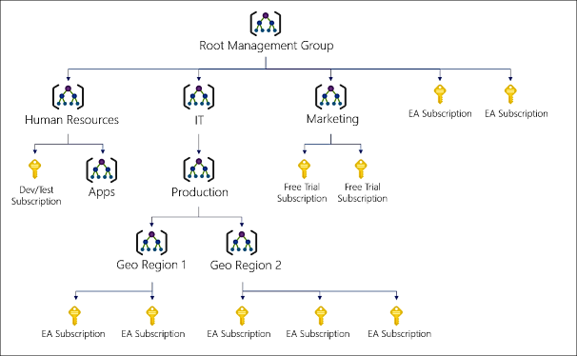
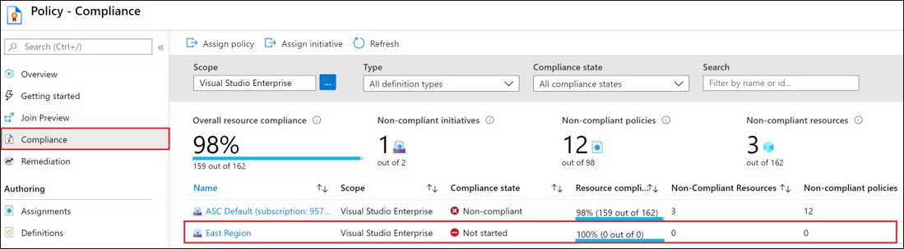

# [Configure Azure policy](https://docs.microsoft.com/en-us/learn/modules/configure-azure-policy/)

## Learning objectives

* Create management groups to target policies and spend budgets.
* Implement Azure policy with policy and initiative definitions.
* Scope Azure policies and determine compliance.

## Management Groups

Highest level grouping object. Allows for nesting, and can contain Subscriptions which then in turn contain Resource Groups.

## Azure Policies

Azure Policy is the official name of the service. It allows you to create, assign and manage **policy definitions** that enforce different **rules** over certain **scopes**. A group of policies can be combined to form an **initiative**. Azure Policy then runs your rules to evaluate the resources in scope. Some example use cases could include:

* Specify the resource types that your organization can deploy.
* Specify a set of virtual machine SKUs that your organization can deploy.
* Restrict the locations your organization can specify when deploying resources.
* Enforce a required tag and its value.
* Audit if Azure Backup service is enabled for all Virtual machines.

Results can then be analyzed in Azure Policy to asses compliance:

