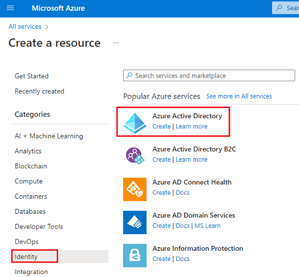
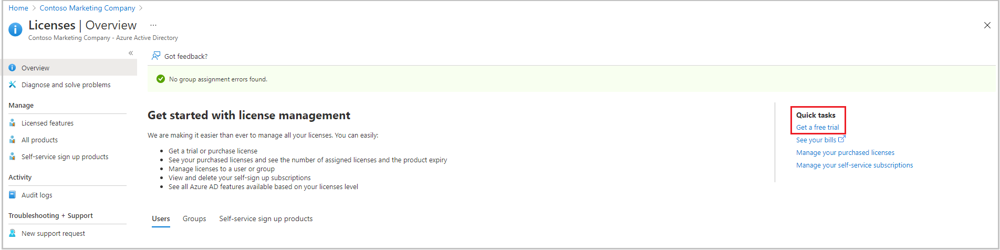
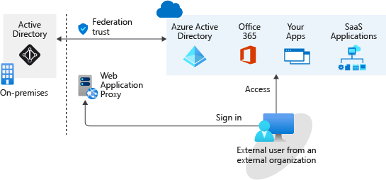

# [6 Create Azure users and groups in Azure AD](https://docs.microsoft.com/en-us/learn/modules/create-users-and-groups-in-azure-active-directory/)

## Learning objectives

* Add users to Azure Active Directory.
* Manage app and resource access by using Azure Active Directory groups.
* Give guest users access in Azure Active Directory business to business (B2B).

## User account types in AAD

* **Administrators**: Full access, allowing the admin to assign roles to users (including admin roles), manage licenses, reset password and create/edit users,
* **Member users**: The 'standard' account for someone in your organization
* **Guest users**: For external parties. The least access. Can be invited (by default) by regular users, but admins can change this setting. Has very little access by default, everything needs to be assigned to it

## Account management

### CLI

```bash
az ad user create
az ad user delete
```

### PowerShell

```PowerShell
# single
New-AzureADUser
Remove-AzureADUser

# bulk
$invitations = import-csv c:\bulkinvite\invitations.csv

$messageInfo = New-Object Microsoft.Open.MSGraph.Model.InvitedUserMessageInfo

$messageInfo.customizedMessageBody = "Hello. You are invited to the Contoso organization."

foreach ($email in $invitations)
   {New-AzureADMSInvitation `
      -InvitedUserEmailAddress $email.InvitedUserEmailAddress `
      -InvitedUserDisplayName $email.Name `
      -InviteRedirectUrl https://myapps.microsoft.com `
      -InvitedUserMessageInfo $messageInfo `
      -SendInvitationMessage $true
   }
```

### Azure Portal

1. Create a new AAD tenant
    * 
1. Get free trial for AAD Premium
    * 
1. Create user: Manage > Users > New user > Create user
1. Delete a user: Manage > Users > choose a user > Delete
1. Restore a deleted user: Manage > Users > Deleted users > choose a user > Restore users

## Access rights with Azure AD roles

AAD roles can be used to manage anything in AD. Your enterprise licenses can often be managed this way, allowing you to assign licenses to the right users either manually or based on configured rules.

|Way to assign access right|Description|
|--|--|
Direct assignment|Manually assign the required rights to a user, by assigning them a role with the appropriate rights.
Group assignment|Assign required rights to a group, such that every member of the group then inherits the rights.
Rule-based assignment|Determine group membership based on user or device properties. AAD automatically maintains the group.

[Exercise on creating groups in AAD](https://docs.microsoft.com/en-us/learn/modules/create-users-and-groups-in-azure-active-directory/5-exercise-assign-users-azure-ad-groups) | [Exercise on inviting a guest user](https://docs.microsoft.com/en-us/learn/modules/create-users-and-groups-in-azure-active-directory/7-exercise-guest-user-access-azure-ad-b2b)

## Collaborate with different organizations by using their identities

We do not want to manage the identities of an external guest user, so we create guest users linked to that user's external identity - using for example their corporate email. As a result, the external user has one account (with their home organization) that can then also be used to authenticate to *our* services.

This is different to *AD Federation*, which is when two organizations 'link' their AD instances together. Requires significant trust between the organizations, and the architecture can get complex with on-prem instances needing to potentially support authenticating in from the outside.


