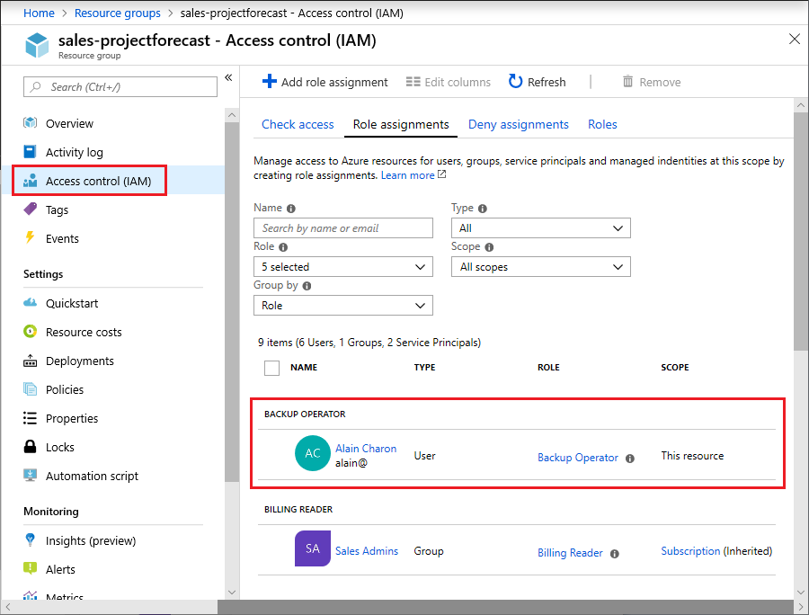
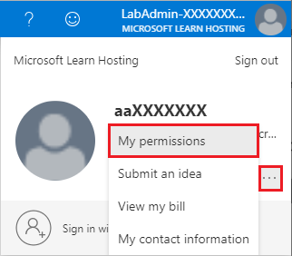
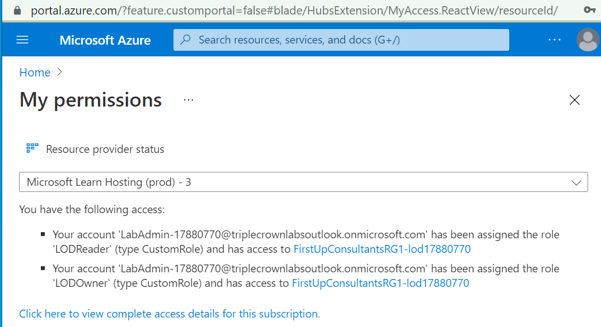
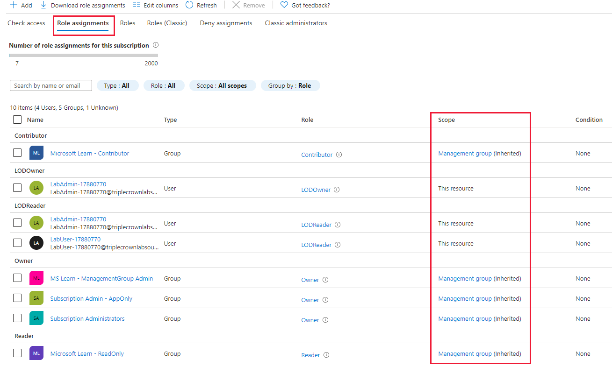
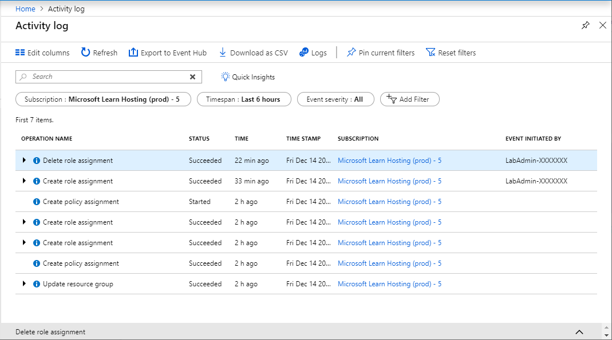

# [Secure your Azure resources with RBAC](https://docs.microsoft.com/en-us/learn/modules/secure-azure-resources-with-rbac/)

## Learning objectives

* Verify access to resources for yourself and others
* Grant access to resources
* View activity logs of Azure RBAC changes

## Azure RBAC

RBAC offers SSO and access management over your Azure resources to every subscription attached to a particular AAD tenant.

RBAC offers works by **assignment** of the relevant **role definition** to a **security principal** (user, group or application) at a particular **scope** (MG, Sub, RG, resource). The specific **Actions** and **NotActions** of the role definition define what the user with that role can and cannot do to the resources in the relevant scope.

Roles are additive, and follow an **allow** model. **Actions** and **NotActions** are used only *within* that role to determine what actions are allowed. Therefore, if a user has two distinct roles, one with **NotAction** and one with an **Action** for the same thing, the net effect is that the user ***can*** execute that action.

### Linkage between AAD Roles, Azure roles and Classic subscription admin roles

### RBAC in Azure Portal (Access control IAM)

### Check role assignments in Azure Portal

### RBAC Activity log in Azure Activity Log

