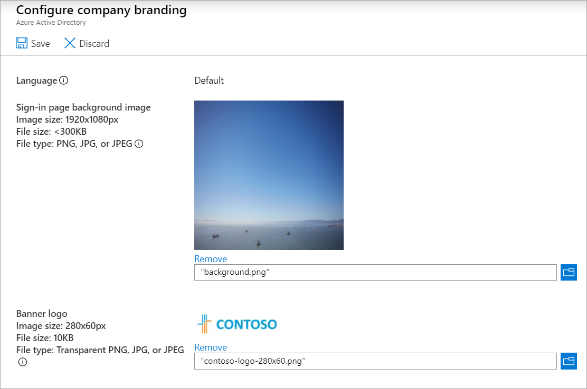
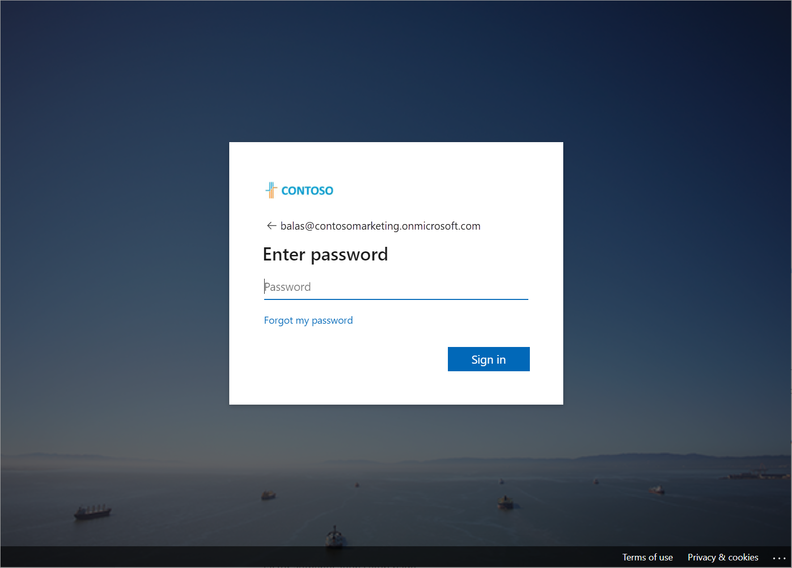

# [Allow users to reset their password with Azure Active Directory self-service password reset](https://docs.microsoft.com/en-us/learn/modules/allow-users-reset-their-password/)

## Learning objectives

* Decide whether to implement self-service password reset. (not covered in the notes as this is obvious)
* Implement self-service password reset to meet your requirements.
* Configure self-service password reset to customize the experience.

## SSPR Flow

1. **Localization**: The portal checks the browser's locale setting and renders the SSPR page in the appropriate language.
1. **Verification**: The user enters their username and passes a captcha to ensure that it's a user and not a bot.
1. **Check if enabled for user**: SSPR may be enabled for everyone, selected users, or for nobody - hence it's possible for the flow to stop here.
1. **Authentication**: The user enters the required data to authenticate their identity. They might, for example, enter a code or answer security questions.
1. **Password reset**: If the user passes the authentication tests, they can enter a new password and confirm it.
1. **Notification**: A message is sent to the user to confirm the reset.

## Available authentication methods for SSPR

Admin can specify minimum number of methods that need to be set up by the user: 1 or 2. Users can choose which ones to use among those enabled.

For security questions, the admin can also specify minimum number of questions. 

|Auth method|Registration|Usage|Tip|
|--|--|--|--|
Mobile app notification|Install Microsoft Authenticator App and register in the app.|Azure sends notification to the app for the user to verify. Uses device biometrics.|Use this as the primary method.
Mobile app code|As above - using Microsoft Authenticator app.|Enter code given by the app. (login to the app likely protected by device biometrics)|Use this as the primary method.
Email|Provide an external email address|Verification code is sent to that address.|Use this as the 'good' alternative.
Office phone|Register non-mobile phone number.|Automated call, pick up and press #.|Use this as a 'good' tertiary alternative.
Mobile phone|Provide a phone number.|Send verification code via SMS, or an automated call.|Not preferred as SMS can be spoofed.
Security questions|Select questions and define the answers.|Answer the questions correctly.|Least preferable, answers may be known to many people.

### Notification options (true/false)

* Notify users on password reset: Inform the user via both primary and secondary emails that their password was reset.
* Notify all admins when any admin resets their password

### Notes for administrator accounts

* Security questions are NOT available as an auth method.
* Two-method authentication requirement policy is always applied to administrator-role accounts, regardless of the setting for regular users. 

## Notes on AAD Connect & cloud sync

SSPR can be deployed with writeback using AAD connect or cloud sync, to enable syncing changed passwords across domains. Cloud sync may also help with higher availability by not relying on a single AAD connect. 

[Read more about this topic: Comparing AAD Connect sync vs. Cloud sync](https://docs.microsoft.com/en-us/azure/active-directory/cloud-sync/what-is-cloud-sync#how-is-azure-ad-connect-cloud-sync-different-from-azure-ad-connect-sync)

## Customizing AAD branding

1. Go to your Azure AD organization
1. Under **Manage**, select **Company branding** > **Configure**

