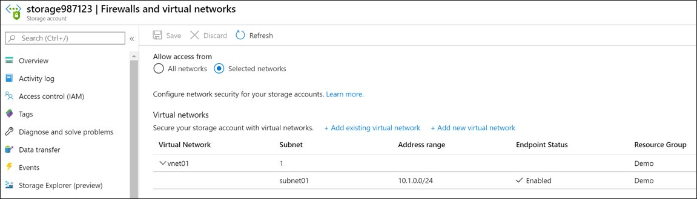

# [Configure storage accounts](https://docs.microsoft.com/en-us/training/modules/configure-storage-accounts/)

## Learning objectives

* Identify features and usage cases for Azure storage accounts.
* Select between different types of storage and storage accounts.
* Select a storage replication strategy.
* Configure network access to storage accounts.
* Secure storage endpoints.

## Basics of Azure storage

|Feature|Description|
|--|--|
Durable and highly available|Redundancy ensures safety of data. Replication occurs across data centers and/or geographical regions.
Secure|All data is encrypted by the service, and RBAC is supported.
Scalable|Massively scalable and performant.
Accessible|Accessible from anywhere via HTTP/HTTPS. SDKs provided in variety of languages, and scripting supported via PS/CLI. Azure Portal and Azure Storage Explorer offer easy visual solutions for working with data.

## Three main categories of Azure Storage

|Category|Description|
|--|--|
Storage for VMs|Disk and file storage for VMs - 'persistent block storage'.
Unstructured data|Blobs (highly scalable REST-based cloud object store) and Data Lake Store (Hadoop DFS as a service).
Structured data|Tables (Autoscaling key/value NoSQL), Cosmos DB (globally distributed DB service), Azure SQL DB (fully managed SQL-DB-as-as-service).

## Storage tiers - how the data is physically stored

* **Standard** is HDD-based and cheaper. Good for bulk storage and infrequent access.
* **Premium** is SSD-based and pricier. Good for low-latency applications and I/O intensive applications like DBs.

## Service: Azure Containers / Blobs

Object storage, optimized for massive amounts of unstructured data, such as text or binary data. Optimal use cases:

* Serving images/docs directly to a browser
* Storing files for distributed access
* Streaming video and audio
* Storing data for backup/restore, DR and archival
* Storing data for analysis

## Service: Azure Files

Highly available network file share - like a NAS/network shared drive. Accessible via SMB (Server Message Block) and NFS (Network File System) protocols, meaning multiple VMs can read/write on the same files. Use cases:

* Many on-prem systems use NFS, so Azure Files is often used to help migrate those systems to the cloud with minimal changes
* Config files can be stored and shared by multiple VMs
* Good place to store diagnostic logs, metrics, crash dumps etc. for later processing

## Service: Queue storage

Store and retrieve messages in a queue format. A queue can contain millions of messages, up to 64 KB per message. Used in distributed systems and asynchronous processing. Example use case would be to automate creation of image thumbnails using requests sent to a queue, where an Azure Function could then downscale and create thumbnails independently of the host process.

## Service: Table storage

(Now part of Cosmos DB). Throughput-optimized tables, global distribution, automatic secondary indexes. Optimal for structured ***non-relational*** data.

## Storage account kinds

This is the most confusing part of Azure storage, so read through this part 10000 times every time you come across it.

|Storage account type|Recommended usage|Replication options available|
|--|--|
Standard GP V2|Most; Blob, File, Queue, Table, Data lake
Premium block blob|Block blobs for high transaction rates and minimal latency
Premium file shares|High-performance file share applications
Premium page blobs|High-performance page blob scenarios

## [Replication strategies](https://docs.microsoft.com/en-us/training/modules/configure-storage-accounts/5-determine-replication-strategies)

|Scenario vs. is data accessible?|LRS|ZRS|GRS|RA-GRS|GZRS|RA-GZRS|
|--|--|--|--|--|--|--|
Node unavailability within data center|✅|✅|✅|✅|✅|✅
Entire data center (zonal or non-zonal) unavailable|❌|✅|✅|✅|✅|✅
Region wide outage|❌|❌|✅|✅|✅|✅
Read access (via remote, geo-replicated region) if region is unavailable|❌|❌|❌|✅|❌|✅|

Availability with each storage account type. ***If it has a Z in it, it only works with GPv2 account type!***

|Storage account type|LRS|ZRS|GRS/RA-GRS|GZRS/RA-GZRS|
|--|--|--|--|--|
Blob|✅|❌|✅|❌
GPv1|✅|❌|✅|❌
GPv2|✅|✅|✅|✅

**Note: Replication strategies aren't tradeoffs in terms of data security - each one is 'safer' than the last but has other tradeoffs in terms of cost, speed etc. Order is LRS, ZRS, GRS, RA-GRS, GZRS, RA-GZRS**.

### LRS - Locally redundant storage

**Protection against a specific node/infrastructure failure.**

* Cheapest
* Replication only in the same data-center - if it explodes, you can lose everything.

**Good for:** low-value/easily replicated data, constantly changing data where long-term permanent storage isn't a must, potentially when requirements demand storing data only in one country.

### ZRS - Zone redundant storage

**Protection against an availability zone failure.**

* **Synchronous** replication of data to 3 storage clusters (each in its own AZ - implying independent utilities and networking) in a single region.
* Excellent performance, low latency
* Not yet available in all regions

### GRS - Geo-redundant storage

**Protection against an entire region failure.** - 16 9's durability.

* Changes are first replicated with LRS synchronously, and then asynchronously to the secondary region for GRS. Once in the second region, it is also replicated with LRS.
* **GRS**: Data is replicated to the secondary region, but only available for read-only ***if Microsoft initiates a failover from the primary region.***
* **RA-GRS**: Same, except your data is always read-only accessible regardless of what Microsoft does or doesn't do.

### GZRS - Geo-zone redundant storage

**Combines high availability of ZRS with protection from regional outages provided by GRS.** - 16 9's durability.

* Data is replicated across 3 AZs in the primary region (ZRS), and also to a secondary region (GRS).
* Operate as normal in case of an AZ failure; also have data durability in case of a regional outage in which the primary region is lost.
* **GZRS**: Data is replicated within primary region to separate AZs, as well as to the secondary region, but only available from secondary region for read-only ***if Microsoft initiates a failover from the primary region.***
* **RA-GzRS**: Same, except your secondary region data is always read-only accessible regardless of what Microsoft does or doesn't do.

## Accessing storage

Every object stored in Azure has a unique URL address, formed from the name of the storage account, type of storage, and other parameters.

For example, if your storage account is named mystorageaccount, then the default endpoints for your storage account are:

* Container service: ```//mystorageaccount.blob.core.windows.net```
* Table service: ```//mystorageaccount.table.core.windows.net```
* Queue service: ```//P.queue.core.windows.net```
* File service: ```//mystorageaccount.file.core.windows.net```

**Custom domains** can be configured for blobs, via either direct CNAM mapping or via an intermediary domain.

* Via CNAMEs, map e.g. ```blobs.contoso.com``` to ```contosoblobs.blob.core.windows.net```.
* Via intermediary mapping, do the same as above, except also add in ```asverify.blobs.contoso.com``` to ```asverify.contosoblobs.blob.core.windows.net```.

**Securing storage endpoints**: You can configure which virtual networks can access a storage account, in order to protect it from the outside world. Specific public IP ranges could also be defined.


