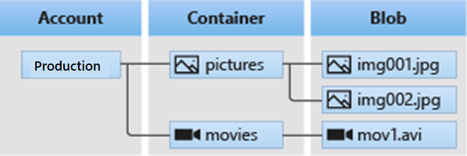
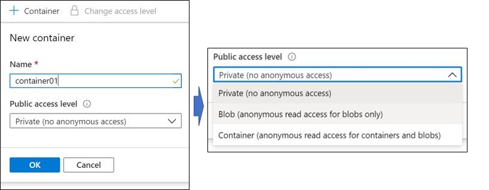
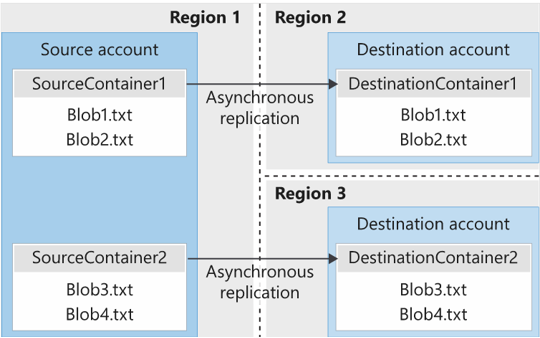

# [Configure blob storage](https://docs.microsoft.com/en-us/training/modules/configure-blob-storage/)

## Learning objectives

* Identify features and use cases for Azure Blob Storage
* Configure Blob storage and Blob access tiers
* Configure Blob lifecycle management rules
* Configure Blob object replication
* Upload and price Blob storage

## Blob storage use cases - unstructured data as 'blobs'

* Serving images or other documents (like PDFs) directly to a browser
* Storing files for distributed access (like software artifacts)
* Streaming video and audio
* Storing data for backup/restore, DR and archival
* Storing data for analysis by other services

## Structure of blog storage

A **storage account** holds **containers** which can then hold **blobs**. A blob ***must*** belong to a container. There are no limits to number of containers per account, or number of blobs per container.



## Creating a container

Container name:

* Container name can only contain lowercase alphanumeric characters and hyphens
* Container name must start with an alphanumeric character, and must be of length 3-63 characters

```shell
# powershell
New-AzStorageContainer

# CLI
az storage container create --name
```

## Container Public access level options

* Private (no anonymous access)
* Blob (anonymous read access for blobs only)
* Container (anonymous read access for blobs and containers)



## Blob access tiers

|Access Tier|Description|
|--|--|
Hot (**default**)|Optimized for frequent access. The standard option.
Cool|Infrequent access, stored for at least 30 days. Cheaper storage per GB than Hot tier, but reads are more expensive.
Archive|Lowest cost per GB, but several hours of retrieval latency and reads are the most expensive. Data must stay in archive for at least 180 days.

## Blob lifecycle management rules (GPv2 and Blob storage account types only)

Purpose: Move blobs to less expensive storage tiers depending on certain conditions.

* Delete blobs based on usage
* Move blobs to cooler archive tiers based on usage

Rules are evaluated once per day at storage account level, and can be applied at a container or a subset-of-blobs level.

## Blob object replication

* Minimize latency: Replicate objects to regions closer to clients to reduce latency
* Increase compute efficiency: Different nodes can process same sets of blobs in different regions
* Optimize distribution: Process/analyze once, and replicate results only
* Optimize costs: Replicate and then move to archive/cool tiers with lifecycle management rules to reduce costs

Limitations:

* Object replication requires that blob versioning is enabled on both the source and destination accounts.
* Object replication doesn't support blob snapshots. Any snapshots on a blob in the source account are not replicated to the destination account.
* Object replication is supported when the source and destination accounts are in the hot or cool tier. The source and destination accounts may be in different tiers.
* When you configure object replication, you create a replication policy that specifies the source storage account and the destination account. A replication policy includes one or more rules that specify a source container and a destination container and indicate which block blobs in the source container will be replicated.



## Blob types - immutable for each blob and set during creation

|Type|Description|Use case
|--|--|--|
Block blobs (**default**)|Consists of blocks of data assembled into a single blob.|Files, images, videos
Append blobs|Similar to block blobs, but optimized for append operations, such as...|...logging.
Page blobs|Up to 8 TB in size, most efficient for frequent read/write.|Virtual machine OS and data disks

## Uploading blobs - any filetype, any size

* **AzCopy** is a command-line tool for Windows and Linux that copies data to and from Blob storage, across containers, or across storage accounts.
* The **Azure Storage Data Movement** library is a .NET library for moving data between Azure Storage services. The AzCopy utility is built with the Data Movement library.
* **Azure Data Factory** supports copying data to and from Blob storage by using the account key, shared access signature, service principal, or managed identities for Azure resources authentications.
* **Blobfuse** is a virtual file system driver for Azure Blob storage. You can use blobfuse to access your existing block blob data in your Storage account through the Linux file system.
* **[Azure Storage Explorer](https://azure.microsoft.com/en-us/products/storage/storage-explorer/#overview)** is a downloadable GUI-based tool for Windows/Linux/Mac for managing Azure storage services.

For on-prem/larger scale transfers:

* **Azure Data Box Disk** is a service for transferring on-premises data to Blob storage when large datasets or network constraints make uploading data over the wire unrealistic. You can use Azure Data Box Disk to request solid-state disks (SSDs) from Microsoft. You can then copy your data to those disks and ship them back to Microsoft to be uploaded into Blob storage.
* The **Azure Import/Export service** provides a way to export large amounts of data from your storage account to hard drives that you provide and that Microsoft then ships back to you with your data.

## Blob storage - pricing considerations

### Tier-based pricing factors

* **Performance tiers**: The storage tier determines the amount of data stored and the cost of storing the data. As the performance tier gets cooler, the per-gigabyte cost decreases.
* **Data access costs**: Data access charges increase as the tier gets cooler. For data in the cool and archive storage tier, you are charged a per-gigabyte data access charge for reads.
* **Transaction costs**: There is a per-transaction charge for all tiers. The charge increases as the tier gets cooler.

### Other data transfer pricing factors

* **Geo-Replication data transfer costs**: This charge only applies to accounts with geo-replication configured, including GRS and RA-GRS. Geo-replication data transfer incurs a per-gigabyte charge.
* **Outbound data transfer costs**: Outbound data transfers (data that is transferred out of an Azure region) incur billing for bandwidth usage on a per-gigabyte basis. This billing is consistent with general-purpose storage accounts.
* **Changing the storage tier**: Changing the account storage tier from cool to hot incurs a charge equal to reading all the data existing in the storage account. However, changing the account storage tier from hot to cool incurs a charge equal to writing all the data into the cool tier (GPv2 accounts only).
