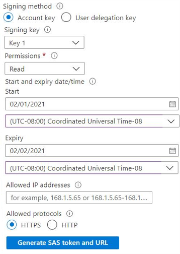

# [Configure storage security](https://learn.microsoft.com/en-us/training/modules/configure-storage-security/?source=learn&ns-enrollment-type=learningpath&ns-enrollment-id=learn.az-104-manage-storage)

## Learning objectives

* Configure shared access signatures including URI and SAS parameters.
* Configure storage service encryption.
* Implement customer-managed keys.
* Recommend opportunities to improve storage security.

## Storage security strategies

|Approach|Description|
|--|--|
Encryption|All data in Azure Storage is automatically encrypted with Storage Service Encryption (SSE). Keys can be either managed by Microsoft (default) or by the customer (can be entered as URI, or selected from Azure Key Vault). Automatically encrypts data for storage, and decrypts for retrieval. **Enabled for all storage services by default, and cannot be disabled**.
Authentication|AAD and RBAC are supported to manage access.
Data in transit|Client-Side Encryption, HTTPS or SMB 3.0 available for securing data in transit.
Disk encryption|OS and data disks used by VMs can use Azure Disk Encryption
Shared Access Signatures|URLs can be created to grant granular access to specific data objects.

## Authorization options

|Authorization option|Description|
|--|--|
AAD|User, group, and applications can be assigned specifically scoped permissions with RBAC.
Shared key|Uses account access keys to produce an encrypted signature string, which is passed as an Authorization header
Shared Access Signatures|URLs that grant access to a particular resource, over a specified time interval.
Anonymous access|Containers and blobs only, can be made read-only to public.

## Shared Access Signatures

Can be defined at account-level, or at specific objects. Specific permissions (read/write/delete) can also be assigned.



Example below, broken down by URI parameter:

```bash
https://myaccount.blob.core.windows.net/?restype=service&comp=properties
&sv=2015-04-05 # storage service version
&ss=bf # which services: b for blob, f for file
&srt=s # resource type: s for service-level operations
&st=2015-04-29T22%3A18%3A26Z # start time
&se=2015-04-30T02%3A23%3A26Z # end time
&sr=b # specific resource: b for blob
&sp=rw # permissions: r for read, w for write
&sip=168.1.5.60-168.1.5.70 # IP range to accept requests from
&spr=https # enforce HTTPS
&sig=F%6GRVAZ5Cdj2Pw4txxxxx # SAS token key
```

## Storage security best practices

* Always enforce HTTPS for SAS
* For unplanned SAS keys, use short term expirations to reduce risks
* Have clients automatically renew SAS before expiration date.
* Be careful with SAS start time - due to clock delays, it is recommended to either **not be set at all or set 15 minutes *before* actual current time.**
* Be as specific as possible with the resource to be accessed
* Your account is billed for operations carried out by SAS. If you give me a SAS with read-write, I can write a 200GB file and share it with a 1000 people at *your cost* - so be careful.
* If a client writes to your storage services using a SAS, you may need to validate data to ensure quality and structure.
* Use **Storage Analytics** to monitor your application - including auth logs for spikes.
