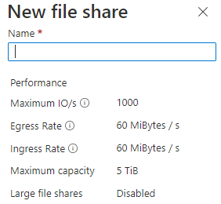
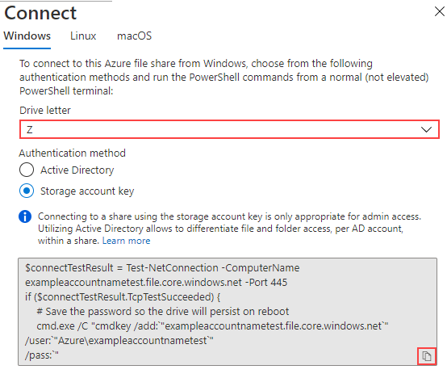
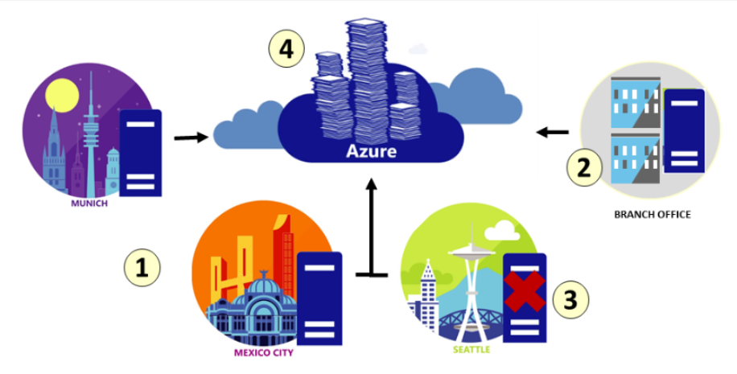
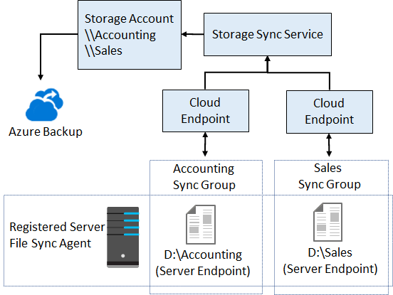
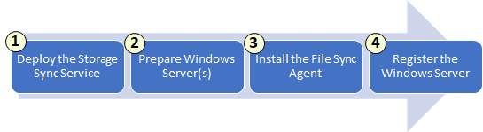

# [Configure Azure files and Azure File Sync](https://learn.microsoft.com/en-us/training/modules/configure-azure-files-file-sync/?source=learn)

## Learning objectives

* Identify when to use Azure files versus Azure Blobs.
* Configure Azure file shares and file share snapshots.
* Identify features and usage cases of Azure File Sync.
* Identify File Sync components and configuration steps.

## Common use cases for Azure Files / "File storage"

Acts as a NAS-type shared storage with the SMB protocol.

* Replace on-prem servers/NAS devices with cloud equivalents
* Enable Lift-and-shift of applications that rely on networked storage
* Access data from anywhere: Directly mount the file share with any (desktop) OS
* Share configuration /logs / diagnostic / data or tools between applications
* Store general-use tools for administration of Azure
* Azure File Sync: Replicate an Azure Files volume directly to a Windows server anywhere, for better performance

## Files vs. Blobs

|Feature|Files|Blobs
|--|--|--|
Interfaces|SMB, NFS and REST|REST only
Structure|Directory objects|Flat namespace
Primary use case|Shared storage for **human** access, lift-and-shift.|Application-intended storage for random access scenarios.

## Creating and mounting an Azure File share

You can enforce **Secure Transfer**, where only HTTPS methods can access a file share.

Choose **Linux** from the tabs of the above image. Azure file shares can be mounted in Linux distributions using the **CIFS kernel client**. File mounting can be done on-demand with the mount command or on-boot (persistent) by creating an entry in /etc/fstab.

## Backing up Azure Files: File share snapshots

Point-in-time read-only copy of your data. Allows for retrieval at individual file level - i.e. you don't need to restore *the entire share*, just the individual file(s) that you need.
At the back, 'share snapshots' are incremental to save storage costs. However, for the end user this is largely invisible - you only *need* to retain the latest snapshot in order to restore the full share.

## Implementing Azure File Sync

lift-and-shift | branch offices | backup and DR | archival

|Component|Purpose|
|--|--|
Storage Sync Service|The Azure resource that you create. Top-level resource and linked to the storage account resource. A subscription can have multiple Storage Sync Services deployed.
Sync Group|Defines the set of files to sync. Any number can be set.
Server Endpoint|A specific location on the **registered server** running the **File Sync Agent**, to which files in your **Sync Group** are copied to.
Registered Server|The server that runs the **File Sync Agent**.
File Sync Agent|Downloadable that manages the syncing. Windows service for monitoring changes and syncing, and separate StorageSync filter to help handle tiering (if cloud tiering - the automated removal of infrequently accessed files from local file share, while maintaining the copies in the cloud - is enabled).
Cloud Endpoint|An Azure File Share that is part of a sync group. Each File Share can only be a member of **one** cloud endpoint and only a member of **one** sync group.

