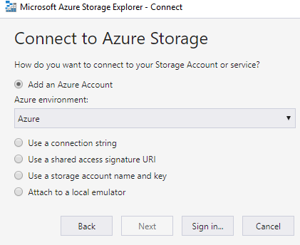
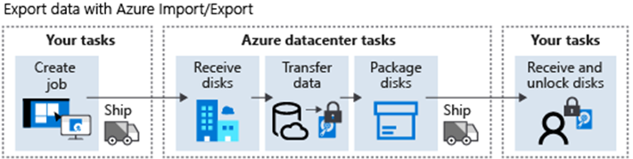

# [Configure storage with tools](https://learn.microsoft.com/en-us/training/modules/configure-storage-tools/)

## Learning objectives

* Configure and use [Storage Explorer](#azure-storage-explorer).
* Configure the [Import and Export Service](#azure-importexport-service).
* Configure and use [AZCopy](#azcopy).

## Azure Storage Explorer

Standalone app to manage storage content. Available on Windows, Mac and Linux. In the standard case (logging in with your Azure account), your access is defined by your Azure RBAC privileges. In other cases, your level of access will be defined by the connection method - for example a SAS URI will only give you the access defined in that URI.



In addition to 'your' resources, it is also possible to mount external storage accounts, external specific storage services, or even external specific storage resources, with name and key information. 

## Azure Import/Export service

Securely import large amounts of data to **Azure Blob (block and page) storage or Azure Files ONLY!** Physical disks are used. Uses the WAImportExport tool, which requires SATA II/III drives, a single NTFS volume, and only runs on a 64-bit version of Windows client or server. The tool handles copying, encryption, and journal file creation.


1. Create Azure Storage account
1. Identify # of disks needed
1. Install WAImportExport tool on a local computer with access to the right data
1. Run WAImportExport to copy and encrypt (BitLocker) data, and generate journal files
1. Create an Import Job on Azure portal under the specific storage account. You must include a destination address to the Azure region where your storage account is located.
1. Ship the disks to the location and update the job with a shipment tracking number.
1. Azure staff will copy data to target Storage account and ship the disks back to you.



1. Identify data in **Blobs** you want to export
1. Identify # of disks needed
1. Create an Export Job on Azure portal under the specific storage account. Specify the blobs to be exported, the return address, and your carrier account number.
1. Ship the required disks to the right Azure region and update the job with a shipment tracking number.
1. Azure receives your disks, copies the data, and sends it back to you. Encryption is done with BitLocker, and the key will be available on Azure portal.

## AZCopy

Command-line utility for copying data to/from **Blob and File storage ONLY!** Copy data between a file system and a storage account, or between storage accounts.

Resilient to connection failures (good for very large files): AzCopy creates a job order and a related log file. You can view/restart previous jobs and resume failed jobs. AzCopy will also automatically retry a transfer after a failure.

**Authentication options depend on your target storage type!**

|Target storage type|AAD Auth|SAS tokens|
|--|--|--|
Azure Data Lake Storage G2<br>ADLS|✅|❌
Blob|✅|✅
File|❌|✅

```shell
# basic syntax
azcopy copy [source] [destination] [flags]
```
